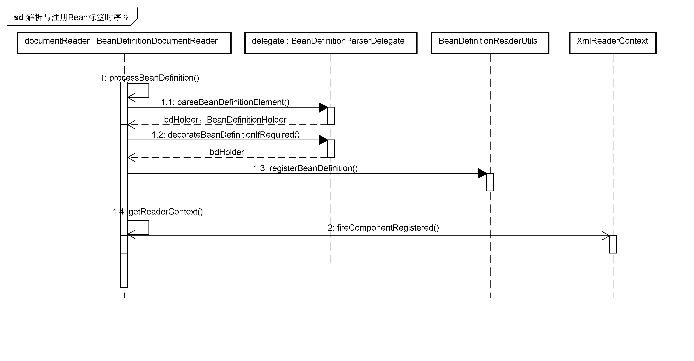
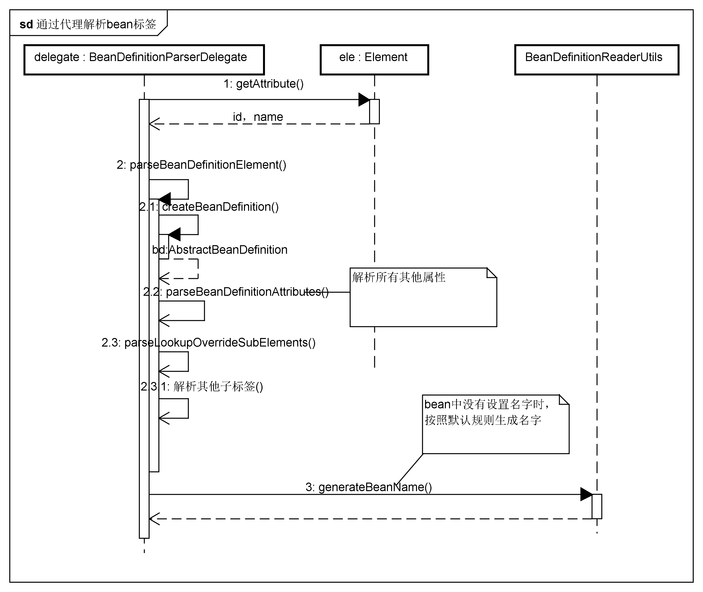

# 解析默认标签
上一节内容中我们完成了解析标签的准备工作，读取了资源文件并解析成Document来从Element中进行标签解析并注册。上一节进入到了DefaultBeanDefinitionDocumentReader类中的parseBeanDefinitions方法中，默认标签的解析是从该方法中调用的parseDefaultElement(ele, delegate)为入口的，该方法的代码如下。由此可见，默认标签的解析被分为了四类进行解析，分别是import,alias,bean,beans.
```java
private void parseDefaultElement(Element ele, BeanDefinitionParserDelegate delegate) {
		if (delegate.nodeNameEquals(ele, IMPORT_ELEMENT)) {
			importBeanDefinitionResource(ele);
		}
		else if (delegate.nodeNameEquals(ele, ALIAS_ELEMENT)) {
			processAliasRegistration(ele);
		}
		else if (delegate.nodeNameEquals(ele, BEAN_ELEMENT)) {
			processBeanDefinition(ele, delegate);
		}
		else if (delegate.nodeNameEquals(ele, NESTED_BEANS_ELEMENT)) {
			// recurse
			doRegisterBeanDefinitions(ele);
		}
	}
```
## 1. 核心类说明
### BeanDefinition
BeanDefinition是一个接口表示配置文件中的<bean>元素，通过继承此接口的虚拟类AbstractBeanDefinition，Spring提供了三种实现，分别是RootBeanDefinition,ChildBeanDefinition,GenericBeanDefinition.分别对应父、子和提供服务的类。在Spring中，需要将<bean>的配置信息一一转化为内部表示即BeanDefinition的实现对象中，然后将其注册到BeanDefinitionRegistry中去，BeanDefinitionRegistry中以map的形式保存，后面需要使用时从BeanDefinitionRegistry中获取即可。
## 2. 四种标签的解析和注册过程
## 2.1 bean标签的解析和注册
bean标签的解析是最核心的部分，我们从该方法开始看。方法主要分为四个步骤，首先通过BeanDefinitionParserDelegate来对元素进行解析，将解析的内容存放在BeanDefinitionHolder对象中。然后当bdHolder中存在自定义的子标签时需要再对此进行解析，然后就是通过BeanDefinitionReaderUtils进行注册，最后就是对注册了监听的监听器发出响应。结合时序图如下：

```java
protected void processBeanDefinition(Element ele, BeanDefinitionParserDelegate delegate) {
		BeanDefinitionHolder bdHolder = delegate.parseBeanDefinitionElement(ele);
		if (bdHolder != null) {
			bdHolder = delegate.decorateBeanDefinitionIfRequired(ele, bdHolder);
			try {
				// Register the final decorated instance.
				BeanDefinitionReaderUtils.registerBeanDefinition(bdHolder, getReaderContext().getRegistry());
			}
			catch (BeanDefinitionStoreException ex) {
				getReaderContext().error("Failed to register bean definition with name '" +
						bdHolder.getBeanName() + "'", ele, ex);
			}
			// Send registration event.
			getReaderContext().fireComponentRegistered(new BeanComponentDefinition(bdHolder));
		}
	}
    ```
### 2.1.1 通过代理解析
我们从通过代理进行解析开始，首先解析出id和name属性来确定beanName，然后进入到parseBeanDefinitionElement方法去解析其他属性，并将其封装到AbstractBeanDefinition中去。当id和name 都为空时，采用默认的方式提供一个beanName，最后再将解析的属性封装到BeanDefinitionHolder中并返回。通过代理解析的时序图如图。

```java
public BeanDefinitionHolder parseBeanDefinitionElement(Element ele, BeanDefinition containingBean) {
		//首先解析出id和name属性
		String id = ele.getAttribute(ID_ATTRIBUTE);
		String nameAttr = ele.getAttribute(NAME_ATTRIBUTE);

		//将name属性分割并储存
		List<String> aliases = new ArrayList<String>();
		if (StringUtils.hasLength(nameAttr)) {
			String[] nameArr = StringUtils.tokenizeToStringArray(nameAttr, MULTI_VALUE_ATTRIBUTE_DELIMITERS);
			aliases.addAll(Arrays.asList(nameArr));
		}

		//id不存在而设置了name属性时的处理，取出aliases中的第一个赋给beanName
		String beanName = id;
		if (!StringUtils.hasText(beanName) && !aliases.isEmpty()) {
			beanName = aliases.remove(0);
			if (logger.isDebugEnabled()) {
				logger.debug("No XML 'id' specified - using '" + beanName +
						"' as bean name and " + aliases + " as aliases");
			}
		}

		if (containingBean == null) {
			checkNameUniqueness(beanName, aliases, ele);
		}

		AbstractBeanDefinition beanDefinition = parseBeanDefinitionElement(ele, beanName, containingBean);
		if (beanDefinition != null) {
			if (!StringUtils.hasText(beanName)) {
            //当没有提供beanName的时候，将按照默认的方法提供一个beanName
				try {
					if (containingBean != null) {
						beanName = BeanDefinitionReaderUtils.generateBeanName(
								beanDefinition, this.readerContext.getRegistry(), true);
					}
					else {
						beanName = this.readerContext.generateBeanName(beanDefinition);
						// Register an alias for the plain bean class name, if still possible,
						// if the generator returned the class name plus a suffix.
						// This is expected for Spring 1.2/2.0 backwards compatibility.
						String beanClassName = beanDefinition.getBeanClassName();
						if (beanClassName != null &&
								beanName.startsWith(beanClassName) && beanName.length() > beanClassName.length() &&
								!this.readerContext.getRegistry().isBeanNameInUse(beanClassName)) {
							aliases.add(beanClassName);
						}
					}
					if (logger.isDebugEnabled()) {
						logger.debug("Neither XML 'id' nor 'name' specified - " +
								"using generated bean name [" + beanName + "]");
					}
				}
				catch (Exception ex) {
					error(ex.getMessage(), ele);
					return null;
				}
			}
			String[] aliasesArray = StringUtils.toStringArray(aliases);
			return new BeanDefinitionHolder(beanDefinition, beanName, aliasesArray);
		}

		return null;
	}
```
#### （1）解析属性
现在我们需要进入到parseBeanDefinitionElement方法中查看其他属性的解析，在此方法中，首先解析了parent属性，据此加上class属性通过createBeanDefinition来创建一个AbstractBeanDefinition对象来搭载属性，然后再解析其他的各种属性并储存在此对象中。
```java
public AbstractBeanDefinition parseBeanDefinitionElement(
			Element ele, String beanName, BeanDefinition containingBean) {

		this.parseState.push(new BeanEntry(beanName));

		String className = null;
        //class属性的解析
		if (ele.hasAttribute(CLASS_ATTRIBUTE)) {
			className = ele.getAttribute(CLASS_ATTRIBUTE).trim();
		}

		try {
			String parent = null;
            //parent属性的解析
			if (ele.hasAttribute(PARENT_ATTRIBUTE)) {
				parent = ele.getAttribute(PARENT_ATTRIBUTE);
			}
            //创建用于封装属性的AbstractBeanDefinition对象
			AbstractBeanDefinition bd = createBeanDefinition(className, parent);
	
    		//解析bean的各种属性
			parseBeanDefinitionAttributes(ele, beanName, containingBean, bd);
			bd.setDescription(DomUtils.getChildElementValueByTagName(ele, DESCRIPTION_ELEMENT));

			//解析各种相应的标签
			parseMetaElements(ele, bd);
			parseLookupOverrideSubElements(ele, bd.getMethodOverrides());
			parseReplacedMethodSubElements(ele, bd.getMethodOverrides());

			parseConstructorArgElements(ele, bd);
			parsePropertyElements(ele, bd);
			parseQualifierElements(ele, bd);

			bd.setResource(this.readerContext.getResource());
			bd.setSource(extractSource(ele));

			return bd;
		}
		catch (ClassNotFoundException ex) {
			error("Bean class [" + className + "] not found", ele, ex);
		}
		catch (NoClassDefFoundError err) {
			error("Class that bean class [" + className + "] depends on not found", ele, err);
		}
		catch (Throwable ex) {
			error("Unexpected failure during bean definition parsing", ele, ex);
		}
		finally {
			this.parseState.pop();
		}

		return null;
	}
```
我们进入到解析所有其他bean属性的parseBeanDefinitionAttributes方法中去，由此可见，在此方法中解析了所有的属性。解析完后回到parseBeanDefinitionElement方法中继续完成子标签的解析。
```java
public AbstractBeanDefinition parseBeanDefinitionAttributes(Element ele, String beanName,
			BeanDefinition containingBean, AbstractBeanDefinition bd) {

		if (ele.hasAttribute(SINGLETON_ATTRIBUTE)) {
			error("Old 1.x 'singleton' attribute in use - upgrade to 'scope' declaration", ele);
		}
		else if (ele.hasAttribute(SCOPE_ATTRIBUTE)) {
			bd.setScope(ele.getAttribute(SCOPE_ATTRIBUTE));
		}
		else if (containingBean != null) {
			// Take default from containing bean in case of an inner bean definition.
			bd.setScope(containingBean.getScope());
		}

		if (ele.hasAttribute(ABSTRACT_ATTRIBUTE)) {
			bd.setAbstract(TRUE_VALUE.equals(ele.getAttribute(ABSTRACT_ATTRIBUTE)));
		}

		String lazyInit = ele.getAttribute(LAZY_INIT_ATTRIBUTE);
		if (DEFAULT_VALUE.equals(lazyInit)) {
			lazyInit = this.defaults.getLazyInit();
		}
		bd.setLazyInit(TRUE_VALUE.equals(lazyInit));

		String autowire = ele.getAttribute(AUTOWIRE_ATTRIBUTE);
		bd.setAutowireMode(getAutowireMode(autowire));

		String dependencyCheck = ele.getAttribute(DEPENDENCY_CHECK_ATTRIBUTE);
		bd.setDependencyCheck(getDependencyCheck(dependencyCheck));

		if (ele.hasAttribute(DEPENDS_ON_ATTRIBUTE)) {
			String dependsOn = ele.getAttribute(DEPENDS_ON_ATTRIBUTE);
			bd.setDependsOn(StringUtils.tokenizeToStringArray(dependsOn, MULTI_VALUE_ATTRIBUTE_DELIMITERS));
		}

		String autowireCandidate = ele.getAttribute(AUTOWIRE_CANDIDATE_ATTRIBUTE);
		if ("".equals(autowireCandidate) || DEFAULT_VALUE.equals(autowireCandidate)) {
			String candidatePattern = this.defaults.getAutowireCandidates();
			if (candidatePattern != null) {
				String[] patterns = StringUtils.commaDelimitedListToStringArray(candidatePattern);
				bd.setAutowireCandidate(PatternMatchUtils.simpleMatch(patterns, beanName));
			}
		}
		else {
			bd.setAutowireCandidate(TRUE_VALUE.equals(autowireCandidate));
		}

		if (ele.hasAttribute(PRIMARY_ATTRIBUTE)) {
			bd.setPrimary(TRUE_VALUE.equals(ele.getAttribute(PRIMARY_ATTRIBUTE)));
		}

		if (ele.hasAttribute(INIT_METHOD_ATTRIBUTE)) {
			String initMethodName = ele.getAttribute(INIT_METHOD_ATTRIBUTE);
			if (!"".equals(initMethodName)) {
				bd.setInitMethodName(initMethodName);
			}
		}
		else {
			if (this.defaults.getInitMethod() != null) {
				bd.setInitMethodName(this.defaults.getInitMethod());
				bd.setEnforceInitMethod(false);
			}
		}

		if (ele.hasAttribute(DESTROY_METHOD_ATTRIBUTE)) {
			String destroyMethodName = ele.getAttribute(DESTROY_METHOD_ATTRIBUTE);
			if (!"".equals(destroyMethodName)) {
				bd.setDestroyMethodName(destroyMethodName);
			}
		}
		else {
			if (this.defaults.getDestroyMethod() != null) {
				bd.setDestroyMethodName(this.defaults.getDestroyMethod());
				bd.setEnforceDestroyMethod(false);
			}
		}

		if (ele.hasAttribute(FACTORY_METHOD_ATTRIBUTE)) {
			bd.setFactoryMethodName(ele.getAttribute(FACTORY_METHOD_ATTRIBUTE));
		}
		if (ele.hasAttribute(FACTORY_BEAN_ATTRIBUTE)) {
			bd.setFactoryBeanName(ele.getAttribute(FACTORY_BEAN_ATTRIBUTE));
		}

		return bd;
	}
```
#### （2）解析子标签
接下来解析的子标签包括meta,lookup-method,replaced-method,constructor-arg,property和qualifier.因为这几种解析的思路都是差不多的，所以只选取constructor-arg这个常用的子标签的解析过程进行分析。
对constructor-arg的解析需要进入到parseConstructorArgElements方法中，然后调用了真正的解析方法parseConstructorArgElement方法。在此方法中，首先解析index、type、name属性，然后根据是否存index属性，当存在index属性时，解析对应的元素属性，将所有的解析的内容都储存在ConstructorArgumentValues.ValueHolder中。最后再将封装后的内容储存在BeanDefinition的genericArgumentValue属性中。
```java
public void parseConstructorArgElements(Element beanEle, BeanDefinition bd) {
		NodeList nl = beanEle.getChildNodes();
		for (int i = 0; i < nl.getLength(); i++) {
			Node node = nl.item(i);
			if (isCandidateElement(node) && nodeNameEquals(node, CONSTRUCTOR_ARG_ELEMENT)) {
				parseConstructorArgElement((Element) node, bd);
			}
		}
	}
```
```java
public void parseConstructorArgElement(Element ele, BeanDefinition bd) {
		String indexAttr = ele.getAttribute(INDEX_ATTRIBUTE);
		String typeAttr = ele.getAttribute(TYPE_ATTRIBUTE);
		String nameAttr = ele.getAttribute(NAME_ATTRIBUTE);
		if (StringUtils.hasLength(indexAttr)) {
			try {
				int index = Integer.parseInt(indexAttr);
				if (index < 0) {
					error("'index' cannot be lower than 0", ele);
				}
				else {
					try {
						this.parseState.push(new ConstructorArgumentEntry(index));
                        //解析子标签
						Object value = parsePropertyValue(ele, bd, null);
						ConstructorArgumentValues.ValueHolder valueHolder = new ConstructorArgumentValues.ValueHolder(value);
						if (StringUtils.hasLength(typeAttr)) {
							valueHolder.setType(typeAttr);
						}
						if (StringUtils.hasLength(nameAttr)) {
							valueHolder.setName(nameAttr);
						}
						valueHolder.setSource(extractSource(ele));
						if (bd.getConstructorArgumentValues().hasIndexedArgumentValue(index)) {
							error("Ambiguous constructor-arg entries for index " + index, ele);
						}
						else {
							bd.getConstructorArgumentValues().addIndexedArgumentValue(index, valueHolder);
						}
					}
					finally {
						this.parseState.pop();
					}
				}
			}
			catch (NumberFormatException ex) {
				error("Attribute 'index' of tag 'constructor-arg' must be an integer", ele);
			}
		}
		else {
			try {
				this.parseState.push(new ConstructorArgumentEntry());
				Object value = parsePropertyValue(ele, bd, null);
				ConstructorArgumentValues.ValueHolder valueHolder = new ConstructorArgumentValues.ValueHolder(value);
				if (StringUtils.hasLength(typeAttr)) {
					valueHolder.setType(typeAttr);
				}
				if (StringUtils.hasLength(nameAttr)) {
					valueHolder.setName(nameAttr);
				}
				valueHolder.setSource(extractSource(ele));
				bd.getConstructorArgumentValues().addGenericArgumentValue(valueHolder);
			}
			finally {
				this.parseState.pop();
			}
		}
	}
```
现在我们进入到解析其子标签的parsePropertyValue方法中去，
```java
public Object parsePropertyValue(Element ele, BeanDefinition bd, String propertyName) {
		String elementName = (propertyName != null) ?
						"<property> element for property '" + propertyName + "'" :
						"<constructor-arg> element";

		// Should only have one child element: ref, value, list, etc.
		NodeList nl = ele.getChildNodes();
		Element subElement = null;
		for (int i = 0; i < nl.getLength(); i++) {
			Node node = nl.item(i);
			if (node instanceof Element && !nodeNameEquals(node, DESCRIPTION_ELEMENT) &&
					!nodeNameEquals(node, META_ELEMENT)) {
				// Child element is what we're looking for.
				if (subElement != null) {
					error(elementName + " must not contain more than one sub-element", ele);
				}
				else {
					subElement = (Element) node;
				}
			}
		}

		boolean hasRefAttribute = ele.hasAttribute(REF_ATTRIBUTE);
		boolean hasValueAttribute = ele.hasAttribute(VALUE_ATTRIBUTE);
        //根据拥有的ref或者value属性，将解析内容封装到RuntimeBeanReference或者TypedStringValue中，然后返回
		if ((hasRefAttribute && hasValueAttribute) ||
				((hasRefAttribute || hasValueAttribute) && subElement != null)) {
			error(elementName +
					" is only allowed to contain either 'ref' attribute OR 'value' attribute OR sub-element", ele);
		}

		if (hasRefAttribute) {
			String refName = ele.getAttribute(REF_ATTRIBUTE);
			if (!StringUtils.hasText(refName)) {
				error(elementName + " contains empty 'ref' attribute", ele);
			}
			RuntimeBeanReference ref = new RuntimeBeanReference(refName);
			ref.setSource(extractSource(ele));
			return ref;
		}
		else if (hasValueAttribute) {
			TypedStringValue valueHolder = new TypedStringValue(ele.getAttribute(VALUE_ATTRIBUTE));
			valueHolder.setSource(extractSource(ele));
			return valueHolder;
		}
		else if (subElement != null) {
			return parsePropertySubElement(subElement, bd);
		}
		else {
			// Neither child element nor "ref" or "value" attribute found.
			error(elementName + " must specify a ref or value", ele);
			return null;
		}
	}
```
至此我们已经完成了将默认标签从XML文件中解析并封装到AbstractBeanDefinition类对象中的过程。完成了在DefaultBeanDefinitionDocumentReader类processBeanDefinition方法中的第一部分任务。
### 2.1.2 解析默认标签中自定义子标签
接下来就是解析默认标签中的自定义标签的解析，适用于当bean使用的是默认的标签配置，而其子标签使用的是自定义配置，并且这个自定义类型是属性的情况。解析的过程发生在BeanDefinitionParserDelegate的decorateBeanDefinitionIfRequired方法中。
```java
public BeanDefinitionHolder decorateBeanDefinitionIfRequired(
			Element ele, BeanDefinitionHolder definitionHolder, BeanDefinition containingBd) {

		BeanDefinitionHolder finalDefinition = definitionHolder;

		// Decorate based on custom attributes first.
		NamedNodeMap attributes = ele.getAttributes();
		for (int i = 0; i < attributes.getLength(); i++) {
			Node node = attributes.item(i);
			finalDefinition = decorateIfRequired(node, finalDefinition, containingBd);
		}

		// Decorate based on custom nested elements.
		NodeList children = ele.getChildNodes();
		for (int i = 0; i < children.getLength(); i++) {
			Node node = children.item(i);
			if (node.getNodeType() == Node.ELEMENT_NODE) {
				finalDefinition = decorateIfRequired(node, finalDefinition, containingBd);
			}
		}
		return finalDefinition;
	}
```
在上面的代码中可以看出，该方法就是将所有节点的元素与子标签都取出来调用decorateIfRequired方法。然后我们跟踪进入该方法中。该方法中就是取出节点的命名空间与默认的进行对比，属于自定义的则获取其解析器进行修饰后返回。
```java
public BeanDefinitionHolder decorateIfRequired(
			Node node, BeanDefinitionHolder originalDef, BeanDefinition containingBd) {
		//取出命名空间与默认命名空间进行对比
		String namespaceUri = getNamespaceURI(node);
		if (!isDefaultNamespace(namespaceUri)) {
        	//根据命名空间找出解析器来进行修饰
			NamespaceHandler handler = this.readerContext.getNamespaceHandlerResolver().resolve(namespaceUri);
			if (handler != null) {
				return handler.decorate(node, originalDef, new ParserContext(this.readerContext, this, containingBd));
			}
			else if (namespaceUri != null && namespaceUri.startsWith("http://www.springframework.org/")) {
				error("Unable to locate Spring NamespaceHandler for XML schema namespace [" + namespaceUri + "]", node);
			}
			else {
				// A custom namespace, not to be handled by Spring - maybe "xml:...".
				if (logger.isDebugEnabled()) {
					logger.debug("No Spring NamespaceHandler found for XML schema namespace [" + namespaceUri + "]");
				}
			}
		}
		return originalDef;
	}
```
### 2.1.3 对解析结果进行注册
上述的步骤已经完成了默认标签的解析，接下来就是对解析结果进行注册了。注册的过程发生在BeanDefinitionReaderUtils.registerBeanDefinition()方法中。在这个方法中，分别通过beanName和别名进行注册。
```java
public static void registerBeanDefinition(
			BeanDefinitionHolder definitionHolder, BeanDefinitionRegistry registry)
			throws BeanDefinitionStoreException {

		// 使用beanName进行注册
		String beanName = definitionHolder.getBeanName();
		registry.registerBeanDefinition(beanName, definitionHolder.getBeanDefinition());

		// 使用别名进行注册
		String[] aliases = definitionHolder.getAliases();
		if (aliases != null) {
			for (String alias : aliases) {
				registry.registerAlias(beanName, alias);
			}
		}
	}
```
接下来我们进入到BeanDefinitionRegistry的registerBeanDefinition方法中去查看使用beanName进行注册的细节。在这个方法中，我们首先对将要注册的bean进行验证，然后查看是否已经被注册并且设置了不能被重写，上述的检验都通过后才进行最终的注册加入到map中，最后刷新缓存。按照别名进行注册与该方法的过程非常相像。
```java
public void registerBeanDefinition(String beanName, BeanDefinition beanDefinition)
			throws BeanDefinitionStoreException {

		Assert.hasText(beanName, "Bean name must not be empty");
		Assert.notNull(beanDefinition, "BeanDefinition must not be null");

		if (beanDefinition instanceof AbstractBeanDefinition) {
			try {
            	//进行校验
				((AbstractBeanDefinition) beanDefinition).validate();
			}
			catch (BeanDefinitionValidationException ex) {
				throw new BeanDefinitionStoreException(beanDefinition.getResourceDescription(), beanName,
						"Validation of bean definition failed", ex);
			}
		}

		BeanDefinition oldBeanDefinition;
		//从当前已注册的结果中取出同名已注册的
		oldBeanDefinition = this.beanDefinitionMap.get(beanName);
		if (oldBeanDefinition != null) {
        	//如果以及注册并且不允许被重写则抛出异常
			if (!isAllowBeanDefinitionOverriding()) {
				throw new BeanDefinitionStoreException(beanDefinition.getResourceDescription(), beanName,
						"Cannot register bean definition [" + beanDefinition + "] for bean '" + beanName +
						"': There is already [" + oldBeanDefinition + "] bound.");
			}
			else if (oldBeanDefinition.getRole() < beanDefinition.getRole()) {
				// e.g. was ROLE_APPLICATION, now overriding with ROLE_SUPPORT or ROLE_INFRASTRUCTURE
				if (this.logger.isWarnEnabled()) {
					this.logger.warn("Overriding user-defined bean definition for bean '" + beanName +
							"' with a framework-generated bean definition: replacing [" +
							oldBeanDefinition + "] with [" + beanDefinition + "]");
				}
			}
			else {
				if (this.logger.isInfoEnabled()) {
					this.logger.info("Overriding bean definition for bean '" + beanName +
							"': replacing [" + oldBeanDefinition + "] with [" + beanDefinition + "]");
				}
			}
		}
		else {
        
        	//添加一些信息
			this.beanDefinitionNames.add(beanName);
			this.manualSingletonNames.remove(beanName);
			this.frozenBeanDefinitionNames = null;
		}
        //注册
		this.beanDefinitionMap.put(beanName, beanDefinition);
		//清除缓存
		if (oldBeanDefinition != null || containsSingleton(beanName)) {
			resetBeanDefinition(beanName);
		}
	}

```
### 2.1.4 通知监听器
当解析和注册的步骤都完成后，通过调用getReaderContext().fireComponentRegistered的方法来通知监听器解析与注册完成。
通过上述的步骤我们已经完成了对默认标签中最核心的bean的解析与注册，现在我们再回过头来看看剩下3个标签的解析，alias、import和beans标签。
## 2.2 alias标签的解析
配置别名有两种方式，分别是在bean标签中的name属性中设置与添加alias标签进行设置。现在我们进入到processAliasRegistration方法中查看具体的解析过程。可以发现其解析过程与bean标签中的alias解析非常类似，就是将别名与beanName组成一对注册到registry中。
```java
protected void processAliasRegistration(Element ele) {
		String name = ele.getAttribute(NAME_ATTRIBUTE);
		String alias = ele.getAttribute(ALIAS_ATTRIBUTE);
		boolean valid = true;
		if (!StringUtils.hasText(name)) {
			getReaderContext().error("Name must not be empty", ele);
			valid = false;
		}
		if (!StringUtils.hasText(alias)) {
			getReaderContext().error("Alias must not be empty", ele);
			valid = false;
		}
        //验证两标签是否都存在内容
		if (valid) {
			try {
            	//进行注册
				getReaderContext().getRegistry().registerAlias(name, alias);
			}
			catch (Exception ex) {
				getReaderContext().error("Failed to register alias '" + alias +
						"' for bean with name '" + name + "'", ele, ex);
			}
			getReaderContext().fireAliasRegistered(name, alias, extractSource(ele));
		}
	}

```
## 2.3 import标签的解析
然后就是对import标签进行解析，import标签是用于导入其他配置文件，这样可以分模块地进行管理。我们进入到import标签的解析方法中。可以看出，在该方法中，首先取出路径属性验证，然后判断其是否为绝对路径，如果不是则先转化为绝对路径再进行解析。最后通知其监听器。
```java
protected void importBeanDefinitionResource(Element ele) {
		String location = ele.getAttribute(RESOURCE_ATTRIBUTE);
		if (!StringUtils.hasText(location)) {
			getReaderContext().error("Resource location must not be empty", ele);
			return;
		}

		// 解析系统属性: e.g. "${user.dir}"
		location = getReaderContext().getEnvironment().resolveRequiredPlaceholders(location);

		Set<Resource> actualResources = new LinkedHashSet<Resource>(4);

		// 判断是绝对路径还是相对路径
		boolean absoluteLocation = false;
		try {
			absoluteLocation = ResourcePatternUtils.isUrl(location) || ResourceUtils.toURI(location).isAbsolute();
		}
		catch (URISyntaxException ex) {
			// cannot convert to an URI, considering the location relative
			// unless it is the well-known Spring prefix "classpath*:"
		}

		// 绝对路径则直接根据地址加载
		if (absoluteLocation) {
			try {
				int importCount = getReaderContext().getReader().loadBeanDefinitions(location, actualResources);
				if (logger.isDebugEnabled()) {
					logger.debug("Imported " + importCount + " bean definitions from URL location [" + location + "]");
				}
			}
			catch (BeanDefinitionStoreException ex) {
				getReaderContext().error(
						"Failed to import bean definitions from URL location [" + location + "]", ele, ex);
			}
		}
		else {
			// 相对路径则先转换成绝对路径再进行加载
			try {
				int importCount;
				Resource relativeResource = getReaderContext().getResource().createRelative(location);
				if (relativeResource.exists()) {
					importCount = getReaderContext().getReader().loadBeanDefinitions(relativeResource);
					actualResources.add(relativeResource);
				}
				else {
					String baseLocation = getReaderContext().getResource().getURL().toString();
					importCount = getReaderContext().getReader().loadBeanDefinitions(
							StringUtils.applyRelativePath(baseLocation, location), actualResources);
				}
				if (logger.isDebugEnabled()) {
					logger.debug("Imported " + importCount + " bean definitions from relative location [" + location + "]");
				}
			}
			catch (IOException ex) {
				getReaderContext().error("Failed to resolve current resource location", ele, ex);
			}
			catch (BeanDefinitionStoreException ex) {
				getReaderContext().error("Failed to import bean definitions from relative location [" + location + "]",
						ele, ex);
			}
		}
        //解析完成后激活对应的监听器
		Resource[] actResArray = actualResources.toArray(new Resource[actualResources.size()]);
		getReaderContext().fireImportProcessed(location, actResArray, extractSource(ele));
	}
```
## 2.4 beans标签的解析
最后是beans标签的解析，其作用也是用于分模块地管理配置文件。其解析过程就是递归地调用bean标签的解析，就不做其他的分析了。
## 3. 扩展
####设计模式
监听器模式
我们注意到在documentReader : BeanDefinitionDocumentReader中完成bean标签的解析与注册后调用了XmlReaderContext的fireComponentRegistered方法来通知在XmlReaderContext中注册了的监听器。这是监听器模式的应用。我们进入到该方法中。可以看到eventListener在构造器中进行注册。当其关注的事件发生后则调用其通知方法。
```java
public void fireComponentRegistered(ComponentDefinition componentDefinition) {
		this.eventListener.componentRegistered(componentDefinition);
	}
// eventListener在构造器中完成注册
public ReaderContext(Resource resource, ProblemReporter problemReporter,
			ReaderEventListener eventListener, SourceExtractor sourceExtractor) {

		this.resource = resource;
		this.problemReporter = problemReporter;
		this.eventListener = eventListener;
		this.sourceExtractor = sourceExtractor;
	}
    
   
```
ReaderEventListener是一个接口，我们需要找到ReaderContext初始化时传入的ReaderEventListener对象是哪个。我们回到documentReader：BeanDefinitionDocumentReader中，发现其持有的readerContext是通过在XmlBeanDefinitionReader中调用registerBeanDefinitions时传入的，而传入的readerContext中的监听器即为XmlBeanDefinitionReader中的监听器。BeanDefinitionDocumentReader的上下文就是XmlBeanDefinitionReader的上下文。
```java
 public XmlReaderContext createReaderContext(Resource resource) {
		return new XmlReaderContext(resource, this.problemReporter, this.eventListener,
				this.sourceExtractor, this, getNamespaceHandlerResolver());
	}
```